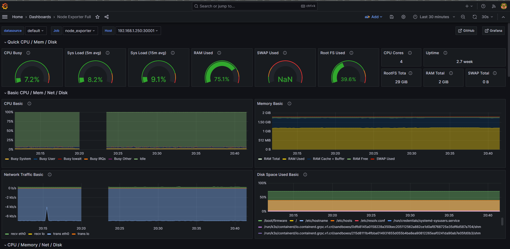

Monitoring
============
### Basic proyect to learn about monitoring in kubernetes.

## Run grafana ## 
- > cd Grafana
- Just start the container.
- > docker-compose up -d

## Run prometheus ## 
- > cd Prometheus
- Modify prometheus.yml adding your node-exporter endpoint
- next start the container.
- > docker-compose up -d

## grafana console
- go to [localhost:3000](http://localhost:3000) **Remember** admin/admin

## Prometheus console
- go to [localhost:9090/graph](http://localhost:9090/graph)
  

