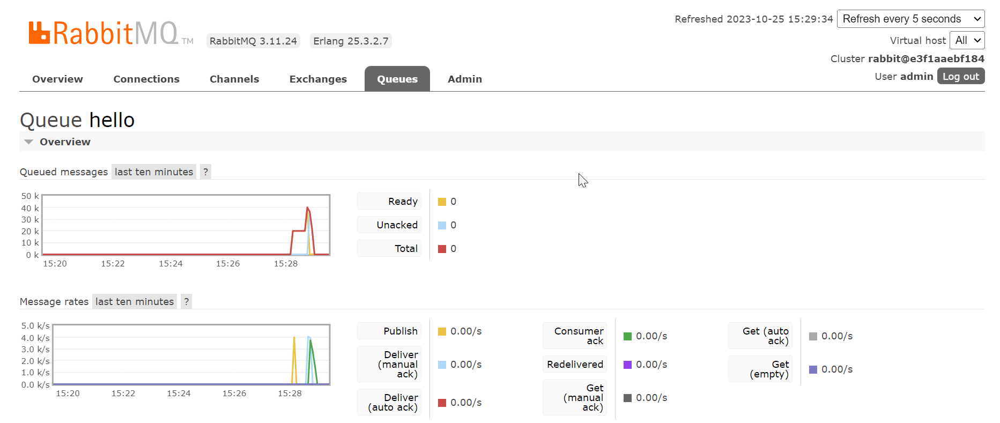
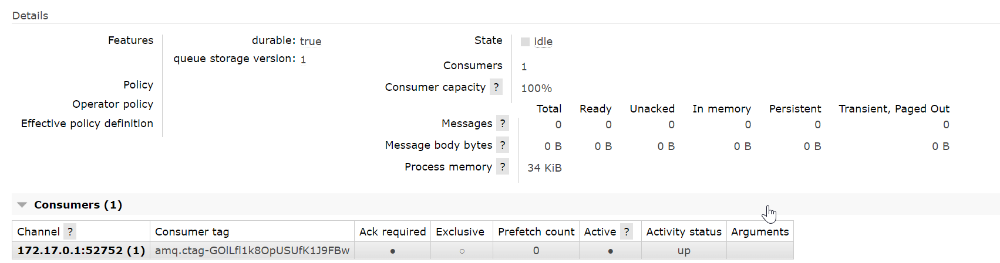

api-ocr
============
### Basic proyect to learn about rabbitmq and queue patron.

## Run rabbitmq server ## 
- Please create .env file in this dir.
- Edit .env file adding two variables:
- >MQUSER=some-user 
- >MQPASS=some-pass
- next just start the container.
- > docker-compose up -d

## Run rabbitmq producer / consumer ## 
- >  node .\clients-js\amqp-consumer.js
- >  node .\clients-js\amqp-producer.js

## Rabbit MQ mangement console
- go to [localhost:8080](http://localhost:8080)

